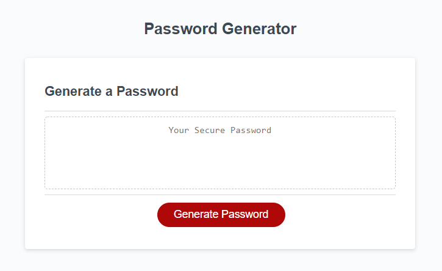
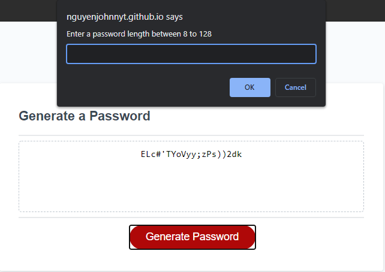
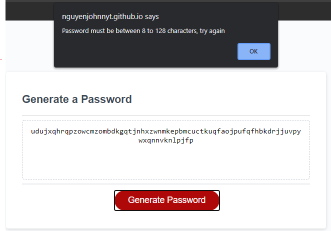
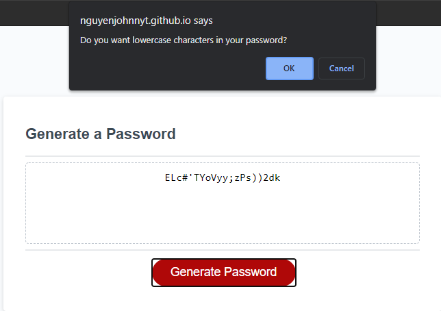
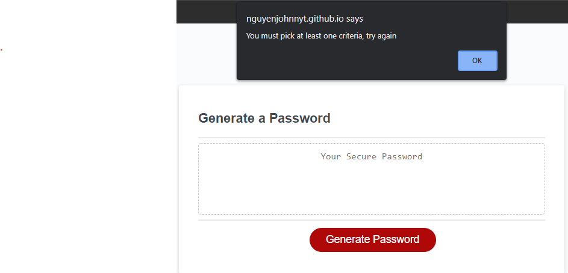
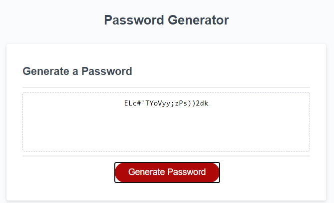

# PasswordGenerator
Password generator for lowercase, uppercase, special characters, and numbers

## Description
This webpage allows the user to create a password to their liking by choosing between or all criterias:

1. 8 to 128 characters
2. lowercase characters
3. uppercase characters
4. special characters
5. numerical characters

The display box will show the user their new password in which they may copy and use.

## Installation

Access via this [link](https://nguyenjohnnyt.github.io/PasswordGenerator/) (https://nguyenjohnnyt.github.io/PasswordGenerator/)

## Usage

By clicking the `Generate Password` button on the page, the user will be prompted by a series of questions.  The user must go through the entire series properly before a password will be generated.  For example, the user cannot proceed if they do not enter a desired character length `not` equal or between 8 to 128 characters.  The user also cannot proceed if they do not select any character criteria.

Once the user successfully answers the prompts, the screen will show a password that complies to their selected criteria.

Screenshots:\
\
Initial page:

Length Prompt: 

Error alert if unsatisfactory length condition used: 

Lower case prompt: 

Error prompt if no criteria selected: 

Example password with all criteria selected: 

## Credits

[UCB Bootcamp](https://bootcampspot.com/)\
[w3schools html](https://www.w3schools.com/html/)\
[w3schools css](https://www.w3schools.com/css/)

## License

GNU General Public License v3.0
